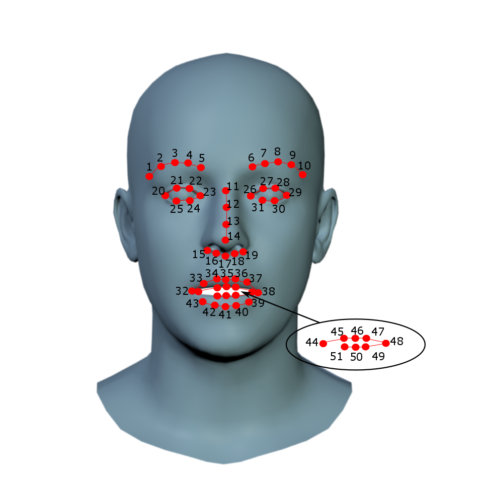

# Masque Fitting

## Description

Masque Fitting vous permet à partir d'un scan 3D d'obtenir les coordonnées des N marqueur correspondant aux points choisie sur le visage flame. (voir [Utilisation](#utilisation)) <br>
Par défaut ils vous retournent ces 105 points : <br>
 <br>
(Cette image est un gif d'illustration issue de [VisageGenerator](https://github.com/Carlier-Maxime/Visage-Generator)) <br>
Bien entendu les coordonnées de ces 105 points sont adapté afin de collé aux masque fournie.


## Installation

### Pré-requis

Pour installer / éxécuter Masque Fitting vous devez avoir :
- [python](https://www.python.org/) (pour éxécutez les fichier python dont ce programme)
- [git](https://git-scm.com/) (pour récupérer les dépendance présant sur des dépot git ([psbody-mesh](https://github.com/MPI-IS/mesh) et [eigen](https://gitlab.com/libeigen/eigen)))
- **g++** (pas tester si nécessaire, mais je suppose qu'il est nécessaire pour compiler [eigen](https://gitlab.com/libeigen/eigen))
- [7zip](https://www.7-zip.org/download.html) ou tout autre gestionnaire de fichier zip afin de dézipper le fichier model

### Récupération

Cloner simplement le projet à l'aide de git dans le répertoire de votre choix :
```
git clone https://github.com/Carlier-Maxime/MasqueFitting
```

### Dépendance

Ouvrez un terminal ou un invite de commande et lancer le fichier d'installation :
```
python INSTALL.py
```

Si vous voulez installer manuellement les dépendance, voici quelques information : <br>

- la liste des dépendance requise se trouve dans les fichier requirements.txt (sauf exception)
- pour psbody-mesh il faudra probalement installer [boost](https://www.boost.org/)
- Pour installer psbody-mesh sous Windows prener la version présent sur ce [dépôt](https://github.com/johnbanq/mesh/tree/fix/MSVC_compilation)
- la plupart des dépendance s'installe avec ```pip install <name_package>``` ou éxécuter ```pip install -r requirements.txt``` qui installera tous les packages requis. sur Windows éxécuter plutôt ```pip install -r requirements_windows.txt```
- lmk-detection utilse numba qui demande une version de numpy antèrieur, Or pour l'utilisation faite il fonctionne avec une version supérieur. <br>
Du coup aller dans le dossier numba (venv/Lib/site-packages/numba sur Windows si installer dans un virtualenv python), dans le fichier \_\_init\_\_.py et supprimer les 2 ligne indiquant la version minimal de numpy (L145-L146).
- par défaut vous devez installer eigen dans flame-fitting/sbody/alignment/mesh-distance. <br>
Pour plus d'information liser le readme de flame-fitting
- pour installer eigen sous windows au lieu de éxécuter ```make``` éxécuter ```python setup.py build_ext --inplace```

en éspérant que ces information pour l'installation manuelle vous auront était utile.
Vous pouvez aussi regarder directement dans le fichier INSTALL.py pour mieux voir les étapes.

### Model

Télécharger le model flame (celui de 2020 de préférence) [ici](https://flame.is.tue.mpg.de/)
et dézipper l'archive obtenue puis placer son contenu (les 3 fichier model) dans flame-fitting/models.
(Vous pouvez vous le faire en même tant que l'installation.)

### Addon

Vous pouvez utiliser les points directement pour les transformer en sphere et faire la difference boolean sur le masque d'entrée <br>
afin d'obtenir directement le masque d'entrée au lieu d'un nuages de points. (format d'enregistrement OBJ et STL supporté) <br>
pour cela il est nécessaire de installer [blender](https://www.blender.org/), car le programme l'utilise pour faire la difference boolean. <br>
Ensuite si vous ne l'avez pas installer à l'endroit par défaut vous devez spécifier le chemin blender au lancement ou dans config.py. <br>

## Utilisation

### pré-requis

Vous devez avoir :
- un ou plusieur scan 3D de masque au format obj ou stl
- un logiciel permettant de placer des point sur un objet 3D et de récupérer les coordonnées de ces dit points. (**conseiller**)
- installer ce programme

### préparation des données d'entrée

Le programme a besoin pour fonctionner de données d'entrée. <br>
Il lui faut un ou plusieur scan 3D au format OBJ ou STL. <br>
Si vous avez un problème lors de la détection de landmakrs, <br>
ajouter pour chaque scan ayant ce problème un fichier contenant les coordonnées des 51 landmark dans l'ordre au format txt ou pp. <br>
Voici une aperçu de là où il faut placer ces 51 landmark et de l'ordre (la précision n'est pas très importante) : <br>
 <br>
(Image issue de [flame-fitting](https://github.com/Rubikplayer/flame-fitting)) <br>
Une fois tous les fichier demander obtenue placer les dans le dossier input.

### éxécution

Maintenant que les données d'entré sont prête vous pouvez éxécuter le programme, <br>
pour cela ouvrez un terminal / invite de commande et éxécuter :
```
python main.py
```

### options

Plusieur paramètre sont disponnible en voici la liste (vous pouvez modifier / voir les valeur par défaut dans config.py) :
- ```--output_format``` : format du fichier de sortie.
- ```--auto_lmk``` : définie si les 51 landmarks sont générés de manière automatique ou non.
- ```--radius``` : rayon des spheres utilisée pour généré les trou des masque lors de l'enregistrement dans le format stl ou obj
- ```--blender_path``` : chemin du dossier contenant [blender](https://www.blender.org/). (inutile de changer si installer à l'endroit par défaut proposer par l'installateur [blender](https://www.blender.org/))

Voici un exemple d'éxécution avec paramètre :
```
python main.py --output_format=stl --auto_lmk=True --blender_path="E:\\Program Files\\Blender Foundation\\Blender 3.2"
```

### récupération des données de sortie

Une fois l'éxécution terminer, vous retrouverer les données de sortie dans le dossier output. <br>
Pour chaque scan il vous ressort un fichier contenant les coordonnées des marqueurs ou le masque trouer resultant. (dépand du format de sortie choisie) <br>
Le fichier à le même nom que le masque d'entrée mais avec l'extension correspondant au format de sortie.

### formats

Liste des différent format prise en charge :
- **npy** : fichier numpy pouvant être lu avec python grâce à numpy.
- **txt** : fichier texte pouvant être lu par Rhinoceros 3D ou dans un éditeur de texte ou un tableur (équivaut à un fichier .csv).
- **pp** : fichier picked points pouvant être lu par MeshLab, il se base sur une structure HTML vous pouvez donc l'ouvrir avec un éditeur de texte.
- **obj** : fichier wavefront (objet 3D),  contient le masque de départ trouer à partir des points des marker (**nécessite [blender](https://www.blender.org/)**)
- **stl** : fichier stéréolithographie (objet 3D) contient le masque de départ trouer à partir des points des marker (**nécessite [blender](https://www.blender.org/)**)
  
## Ressources

Liste des resources utilisée (non exaustive) :
- [Flame](https://flame.is.tue.mpg.de/)
- [flame-fitting](https://github.com/Rubikplayer/flame-fitting)
- [eigen](https://gitlab.com/libeigen/eigen)
- [panda3d](https://www.panda3d.org/)
- [Visage-Generator](https://github.com/Carlier-Maxime/Visage-Generator)
